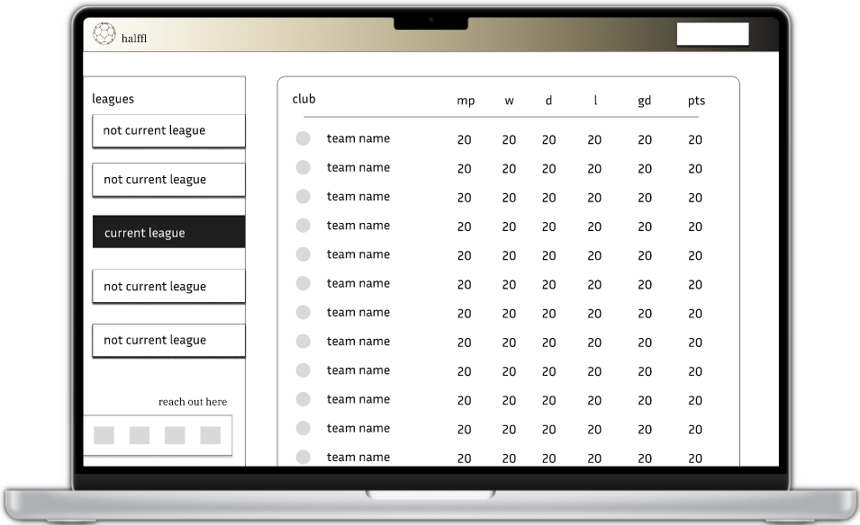

# halffl

halffl (half football leagues) is a website which displays what selected football league tables would look like if points were awarded after each half ended.

## design (preview)

### desktop

## Stack

- ~~made with love~~
- [Next.js](https://nextjs.org)
- [Tailwind CSS](https://tailwindcss.com)

## Installation Instruction

- clone the repo
- open the `halffl` folder
- run `npm i` from your terminal to install all of the project's dependecies
- run `npm run dev` from your terminal to build and start the application
  - if your browser does not open automatically paste http://localhost:3000 in the address bar of your browser and press Enter

## Reasoning

- [Link to Reddit post explaining why I built this](https://www.reddit.com/r/PremierLeague/comments/11kas1q/football_league_tables_if_points_were_awarded/)

## Update - 13/10/2023

- New request to the API fail, error: missing application key. I can't login into my account nor can I create a new account.
